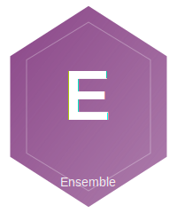

<p align="center">
  
</p>

# CrucibleEnsemble

**Multi-model ensemble prediction with configurable voting strategies for AI reliability research.**

Ensemble is an Elixir library that enables reliable AI predictions by querying multiple language models concurrently and aggregating their responses using sophisticated voting strategies. Built on the BEAM VM, it leverages Elixir's lightweight processes to achieve massive parallelism with minimal overhead.

## Research Motivation

Current AI systems exhibit unacceptably high failure rates in production:
- Single GPT-4 instances achieve ~85-90% reliability
- Production AI agents fail 70-95% of complex tasks
- Mission-critical applications require 99.9%+ reliability

**Ensemble Hypothesis**: Massively concurrent small language model (SLM) ensembles can achieve 99.9%+ reliability at <10% the cost of single large language model approaches.

## Features

- **High Reliability**: Ensemble voting reduces error rates exponentially
- **Multiple Voting Strategies**: Majority, weighted, best confidence, unanimous
- **Flexible Execution**: Parallel, sequential, hedged, cascade strategies
- **Cost Tracking**: Automatic per-model and ensemble cost calculation
- **Telemetry Integration**: Comprehensive instrumentation for research analysis
- **Fault Tolerance**: Graceful degradation when models fail
- **BEAM Concurrency**: Leverages Elixir's lightweight processes for massive parallelism

## Installation

Add `ensemble` to your list of dependencies in `mix.exs`:

```elixir
def deps do
  [
    {:crucible_ensemble, "~> 0.1.0"}
  ]
end
```

Or install from GitHub:

```elixir
def deps do
  [
  ]
end
```

## Quick Start

```elixir
# Basic usage with default settings (majority voting)
{:ok, result} = CrucibleEnsemble.predict("What is 2+2?")

IO.puts(result.answer)
# => "4"

IO.inspect(result.metadata)
# => %{
#   consensus: 1.0,
#   votes: %{"4" => 3},
#   latency_ms: 234,
#   cost_usd: 0.00015,
#   models_used: [:gemini_flash, :openai_gpt4o_mini, :anthropic_haiku],
#   successes: 3,
#   failures: 0
# }
```

## Configuration

Set your API keys as environment variables:

```bash
export GEMINI_API_KEY="your-gemini-key"
export OPENAI_API_KEY="your-openai-key"
export ANTHROPIC_API_KEY="your-anthropic-key"
```

## Usage Examples

### Custom Model Selection

```elixir
{:ok, result} = CrucibleEnsemble.predict(
  "What is the capital of France?",
  models: [:gemini_flash, :openai_gpt4o_mini, :anthropic_haiku]
)
```

### Weighted Voting Strategy

Useful for open-ended questions where model confidence matters:

```elixir
{:ok, result} = CrucibleEnsemble.predict(
  "Explain quantum computing in one sentence.",
  strategy: :weighted,
  models: [:openai_gpt4o, :anthropic_sonnet]
)
```

### Asynchronous Predictions

```elixir
# Start prediction
task = CrucibleEnsemble.predict_async("What is the capital of France?")

# Do other work...
other_work()

# Get result
{:ok, result} = Task.await(task, 10_000)
```

### Multiple Concurrent Predictions

```elixir
questions = [
  "What is 10 * 10?",
  "What is 5 + 5?",
  "What is 100 - 50?"
]

tasks = Enum.map(questions, &CrucibleEnsemble.predict_async/1)
results = Task.await_many(tasks, 10_000)
```

### Streaming Results

```elixir
stream = CrucibleEnsemble.predict_stream(
  "Complex question?",
  models: [:model1, :model2, :model3],
  early_stop_threshold: 0.8
)

Enum.each(stream, fn
  {:response, model, response} ->
    IO.puts "Got response from #{model}"
  {:complete, final_result} ->
    IO.puts "Final answer: #{final_result.answer}"
end)
```

## Voting Strategies

### Majority Voting (`:majority`)

Most common response wins. Simple and interpretable.

```elixir
{:ok, result} = CrucibleEnsemble.predict(
  "What is 2+2?",
  strategy: :majority
)
```

**Best for**: Factual questions, classification tasks, deterministic problems

### Weighted Voting (`:weighted`)

Responses weighted by model confidence scores.

```elixir
{:ok, result} = CrucibleEnsemble.predict(
  "Explain recursion",
  strategy: :weighted
)
```

**Best for**: Open-ended questions, when confidence scores are reliable

### Best Confidence (`:best_confidence`)

Select single highest confidence response. Fast, no consensus.

```elixir
{:ok, result} = CrucibleEnsemble.predict(
  "Generate code",
  strategy: :best_confidence
)
```

**Best for**: Latency-critical applications, heterogeneous ensembles

### Unanimous (`:unanimous`)

All models must agree. Highest confidence, may fail.

```elixir
{:ok, result} = CrucibleEnsemble.predict(
  "Critical decision",
  strategy: :unanimous
)
```

**Best for**: High-stakes decisions requiring absolute consensus

## Execution Strategies

### Parallel (`:parallel`)

Execute all models simultaneously. Maximum quality, higher cost.

```elixir
{:ok, result} = CrucibleEnsemble.predict(
  "Query",
  execution: :parallel
)
```

**Tradeoff**: Fastest completion, all models always called

### Sequential (`:sequential`)

Execute one at a time until consensus. Adaptive cost.

```elixir
{:ok, result} = CrucibleEnsemble.predict(
  "Query",
  execution: :sequential,
  min_consensus: 0.7
)
```

**Tradeoff**: Lower cost, higher latency, may stop early

### Hedged (`:hedged`)

Primary model with backup hedges for tail latency.

```elixir
{:ok, result} = CrucibleEnsemble.predict(
  "Query",
  execution: :hedged,
  hedge_delay_ms: 500
)
```

**Tradeoff**: Optimized P99 latency, controlled cost overhead

### Cascade (`:cascade`)

Priority order with early stopping on high confidence.

```elixir
{:ok, result} = CrucibleEnsemble.predict(
  "Query",
  execution: :cascade,
  confidence_threshold: 0.85
)
```

**Tradeoff**: Fast and cheap, may miss consensus

## Response Normalization

Different normalization strategies for comparing responses:

### Lowercase Trim (`:lowercase_trim`)

Default. Case-insensitive comparison.

```elixir
{:ok, result} = CrucibleEnsemble.predict(
  "Query",
  normalization: :lowercase_trim
)
```

### Numeric (`:numeric`)

Extract numeric values from responses.

```elixir
{:ok, result} = CrucibleEnsemble.predict(
  "What is 2+2?",
  normalization: :numeric
)
# Normalizes "The answer is 4" -> 4.0
```

### Boolean (`:boolean`)

Extract yes/no answers.

```elixir
{:ok, result} = CrucibleEnsemble.predict(
  "Is Elixir functional?",
  normalization: :boolean
)
# Normalizes "Yes, it is" -> true
```

### JSON (`:json`)

Parse JSON responses.

```elixir
{:ok, result} = CrucibleEnsemble.predict(
  "Return JSON",
  normalization: :json
)
```

## Telemetry Integration

Ensemble emits comprehensive telemetry events for research analysis:

```elixir
# Attach default handlers
CrucibleEnsemble.Metrics.attach_handlers()

# Or attach custom handlers
:telemetry.attach(
  "my-ensemble-handler",
  [:ensemble, :predict, :stop],
  fn _event, measurements, metadata, _config ->
    IO.inspect({measurements, metadata})
  end,
  nil
)
```

### Available Events

- `[:ensemble, :predict, :start]` - Prediction started
- `[:ensemble, :predict, :stop]` - Prediction completed
- `[:ensemble, :predict, :exception]` - Prediction failed
- `[:ensemble, :model, :start]` - Individual model call started
- `[:ensemble, :model, :stop]` - Individual model call completed
- `[:ensemble, :model, :exception]` - Individual model call failed
- `[:ensemble, :vote, :complete]` - Voting completed
- `[:ensemble, :consensus, :reached]` - Consensus threshold reached
- `[:ensemble, :consensus, :failed]` - Consensus not achieved

## Cost Tracking

Ensemble automatically tracks costs based on token usage:

```elixir
{:ok, result} = CrucibleEnsemble.predict("Query")

IO.puts "Total cost: $#{result.metadata.cost_usd}"
IO.puts "Cost per model: #{inspect(result.metadata.cost_breakdown)}"
```

Estimate costs before execution:

```elixir
estimate = CrucibleEnsemble.Pricing.estimate_cost(
  [:gemini_flash, :openai_gpt4o_mini],
  estimated_input_tokens: 100,
  estimated_output_tokens: 50
)

IO.puts "Estimated cost: $#{estimate.total_usd}"
```

## Metrics and Analysis

Export metrics for research analysis:

```elixir
# Collect prediction data
predictions = [...]

# Generate statistics
stats = CrucibleEnsemble.Metrics.aggregate_stats(predictions)

IO.puts "Average latency: #{stats.avg_latency_ms}ms"
IO.puts "P95 latency: #{stats.p95_latency_ms}ms"
IO.puts "Average consensus: #{stats.avg_consensus}"
IO.puts "Total cost: $#{stats.total_cost}"

# Export to CSV
CrucibleEnsemble.Metrics.export_to_csv(predictions, "results.csv")

# Generate report
report = CrucibleEnsemble.Metrics.summary_report(predictions)
IO.puts report
```

## Architecture

```
┌─────────────────────────────────────────────────────────────┐
│                      Ensemble System                         │
├─────────────────────────────────────────────────────────────┤
│                                                               │
│  ┌──────────────┐      ┌──────────────┐                     │
│  │   Ensemble   │      │  Ensemble    │                     │
│  │     API      │─────▶│  Supervisor  │                     │
│  └──────────────┘      └──────┬───────┘                     │
│                                │                              │
│                    ┌───────────┼───────────┐                │
│                    ▼           ▼           ▼                 │
│            ┌──────────┐ ┌──────────┐ ┌──────────┐          │
│            │  Model   │ │  Model   │ │  Model   │          │
│            │  Worker  │ │  Worker  │ │  Worker  │          │
│            │   (1)    │ │   (2)    │ │   (N)    │          │
│            └────┬─────┘ └────┬─────┘ └────┬─────┘          │
│                 │            │            │                  │
│                 ▼            ▼            ▼                  │
│            ┌──────────────────────────────────┐             │
│            │        Voting & Aggregation      │             │
│            │  • Majority    • Weighted        │             │
│            │  • Confidence  • Unanimous       │             │
│            └──────────────────────────────────┘             │
│                                                               │
└─────────────────────────────────────────────────────────────┘
```

## Supported Models

- **Google Gemini**: `gemini_flash`, `gemini_pro`
- **OpenAI**: `openai_gpt4o_mini`, `openai_gpt4o`, `openai_gpt4`
- **Anthropic**: `anthropic_haiku`, `anthropic_sonnet`, `anthropic_opus`

## Examples

See the `examples/` directory for complete working examples:

- `basic_usage.exs` - Basic ensemble predictions
- `voting_strategies.exs` - Comparison of voting strategies
- `execution_strategies.exs` - Different execution modes
- `research_experiment.exs` - Research experiment template

Run examples:

```bash
elixir examples/basic_usage.exs
```

## Testing

Run the test suite:

```bash
mix test
```

Run with coverage:

```bash
mix test --cover
```

## Research Applications

This library is designed for AI reliability research. Example research questions:

- **H1**: Does 5-model ensemble achieve >99% reliability vs 85-90% single model?
- **H2**: Does request hedging reduce P99 latency by >25%?
- **H3**: Does BEAM enable 10x more parallel operations than Python?
- **H4**: Is ensemble cost <10% of single GPT-4 at equivalent reliability?

## Performance

Ensemble leverages BEAM's lightweight processes for massive parallelism:

- **Concurrent Models**: Unlimited (bounded by system resources)
- **Process Overhead**: ~2KB per model call
- **Latency**: P99 < single-model P50 (with hedging)
- **Throughput**: Scales linearly with cores

## Contributing

This is a research library. Contributions welcome:

1. Fork the repository
2. Create a feature branch
3. Add tests for new functionality
4. Submit a pull request

## License

MIT License - see [LICENSE](https://github.com/North-Shore-AI/crucible_ensemble/blob/main/LICENSE) file for details

## Citation

If you use Ensemble in research, please cite:

```bibtex
@software{ensemble2025,
  title = {Ensemble: Multi-Model AI Reliability Framework},
  author = {ElixirAI Research Initiative},
  year = {2025},
  url = {https://github.com/elixir-ai-research/ensemble}
}
```

## Acknowledgments

- Built on [req_llm](https://github.com/calebjcourtney/req_llm) for LLM API integration
- Inspired by ensemble methods in machine learning
- Research funded by ElixirAI Initiative

## Support

- Documentation: https://hexdocs.pm/ensemble
- Issues: https://github.com/elixir-ai-research/ensemble/issues
- Discussions: https://github.com/elixir-ai-research/ensemble/discussions

## Roadmap

- [ ] Production connection pooling
- [ ] Circuit breaker pattern
- [ ] Distributed ensemble execution
- [ ] Custom embedding-based voting
- [ ] Real-time metrics dashboard
- [ ] Benchmark harness
- [ ] Integration with LangChain
